# Fluxuri detaliate — Client Android & Server FastAPI

Fiecare secțiune arată: **ce intră → ce se procesează → unde pleacă → ce se întoarce → ce se afișează**.

---

## Cuprins

**Client Android**
1. [Login / Register](#1-login--register)
2. [Corecție fotografie unică](#2-corecție-fotografie-unică)
3. [Batch processing](#3-batch-processing)
4. [Burst mode + best shot](#4-burst-mode--best-shot)
5. [Clustering fotografii](#5-clustering-fotografii)
6. [Stil personalizat](#6-stil-personalizat)
7. [Grupare după fețe](#7-grupare-după-fețe)
8. [Favorite](#8-favorite)
9. [Pipeline vizualizare pas-cu-pas](#9-pipeline-vizualizare-pas-cu-pas)
10. [Blur conținut sensibil](#10-blur-conținut-sensibil)
11. [Trimitere email fotografii](#11-trimitere-email-fotografii)

**Server FastAPI**
12. [/auth/register](#12-authregister)
13. [/auth/login](#13-authlogin)
14. [/search_and_correct](#14-search_and_correct)
15. [/blur-sensitive — calea Gemini](#15-blur-sensitive--calea-gemini)
16. [/blur-sensitive — calea locală YOLOv8](#16-blur-sensitive--calea-locală-yolov8)
17. [/mail/send](#17-mailsend)
18. [/batch/process](#18-batchprocess)
19. [/cluster](#19-cluster)
20. [/lut/{basename}](#20-lutbasename)
21. [/style/*](#21-style)

**Explicații detaliate**
22. [Cum funcționează blur — detaliu complet](#22-cum-funcționează-blur--detaliu-complet)
23. [Cum funcționează mail — detaliu complet](#23-cum-funcționează-mail--detaliu-complet)

---

## CLIENT ANDROID — ACTIVITĂȚI

---

### 1. Login / Register

**Activitate:** `LoginActivity`

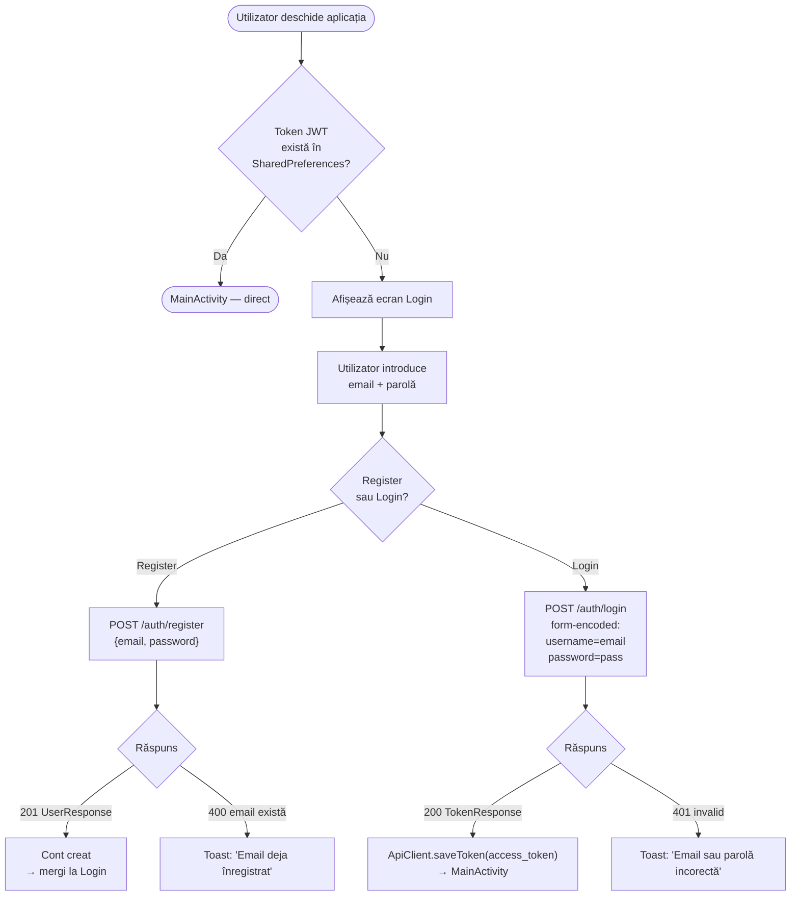

**Ce pleacă spre server:**
- Register: JSON `{"email": "...", "password": "..."}`
- Login: form-data `username=...&password=...` (OAuth2 standard)

**Ce se întoarce:**
- Register: `{"id": 1, "email": "...", "is_active": true, "created_at": "..."}`
- Login: `{"access_token": "eyJ...", "token_type": "bearer"}`

---

### 2. Corecție fotografie unică

**Activități:** `ProcessingActivity` → `ResultsActivity` → `CompareActivity` / `DetailActivity`

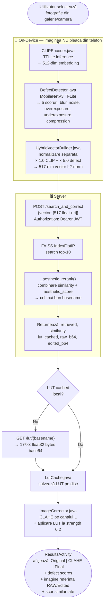

**Ce pleacă spre server:** vectorul de 517 float-uri (nu imaginea)

**Ce se întoarce:** basename-ul imaginii de referință + LUT-ul ca bytes + thumbnail-uri base64

---

### 3. Batch processing

**Activități:** `BatchActivity` → `BatchResultsActivity`

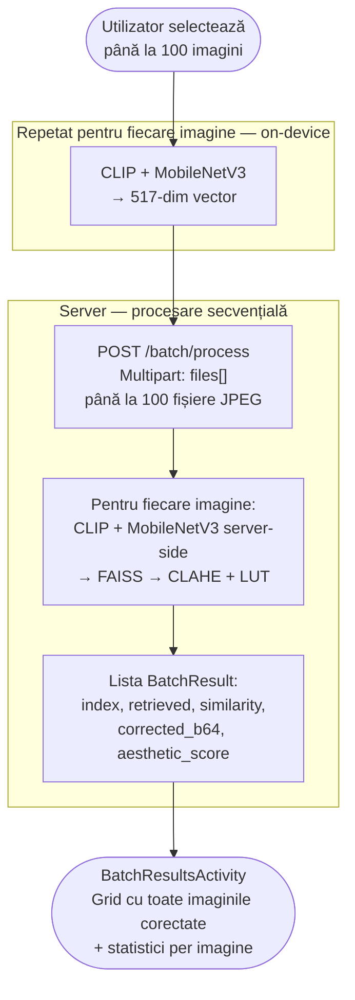

> **Notă:** `/batch/process` rulează inferența CLIP pe server (nu trimite vectorii), spre deosebire de `/search_and_correct` unde clientul trimite vectorul calculat local.

---

### 4. Burst mode + best shot

**Activități:** `BurstActivity` → `BurstResultsActivity`

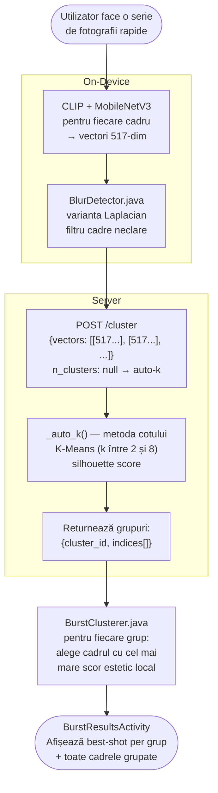

---

### 5. Clustering fotografii

**Activități:** `ClusterActivity` → `ClusterResultsActivity`

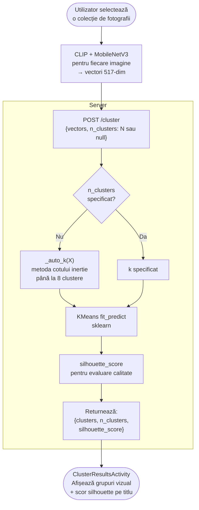

---

### 6. Stil personalizat

**Activitate:** `StyleSetupActivity` → orice activitate de corecție cu stil

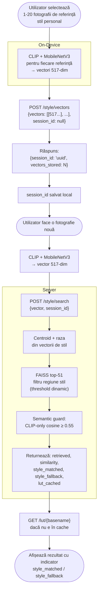

---

### 7. Grupare după fețe

**Activitate:** `FaceGroupsActivity`

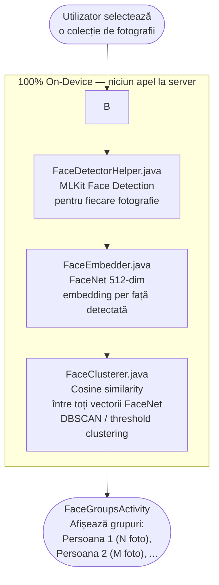

> **Important:** această funcționalitate este complet on-device — nicio imagine și niciun vector nu pleacă din telefon.

---

### 8. Favorite

**Activități:** `FavoritesActivity` → `FavoriteDetailActivity`

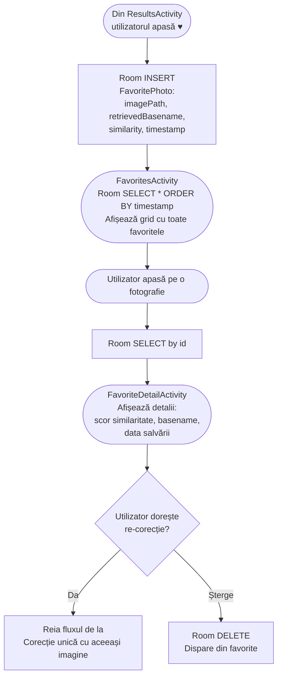

---

### 9. Pipeline vizualizare pas-cu-pas

**Activitate:** `PipelineActivity`

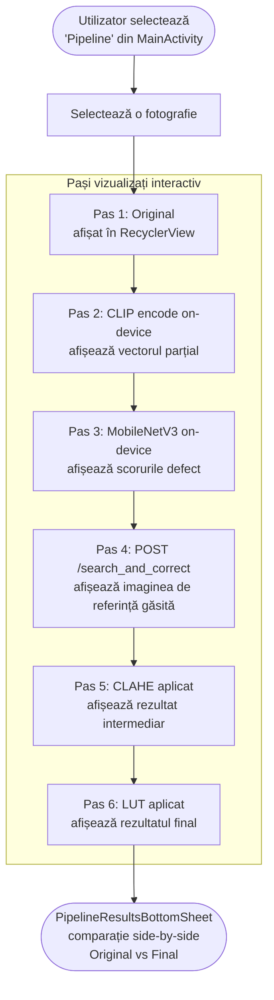

---

### 10. Blur conținut sensibil

**Activitate:** `BlurActivity` *(nou adăugată)*

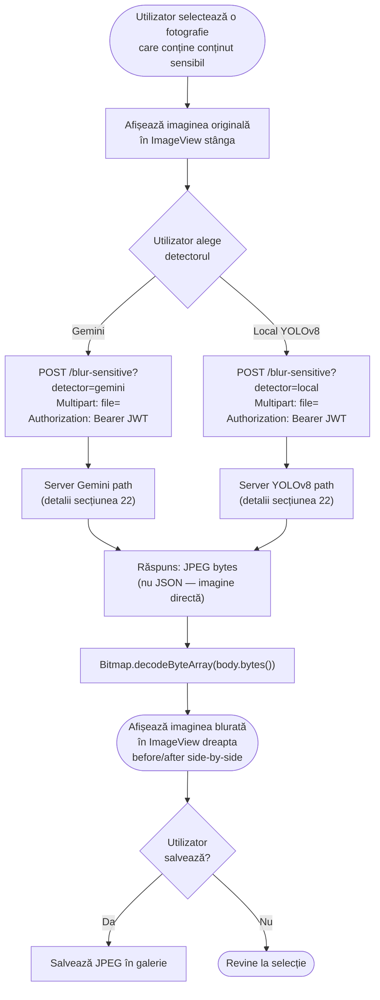

---

### 11. Trimitere email fotografii

**Activitate:** `DeliveryActivity` *(nou adăugată)*

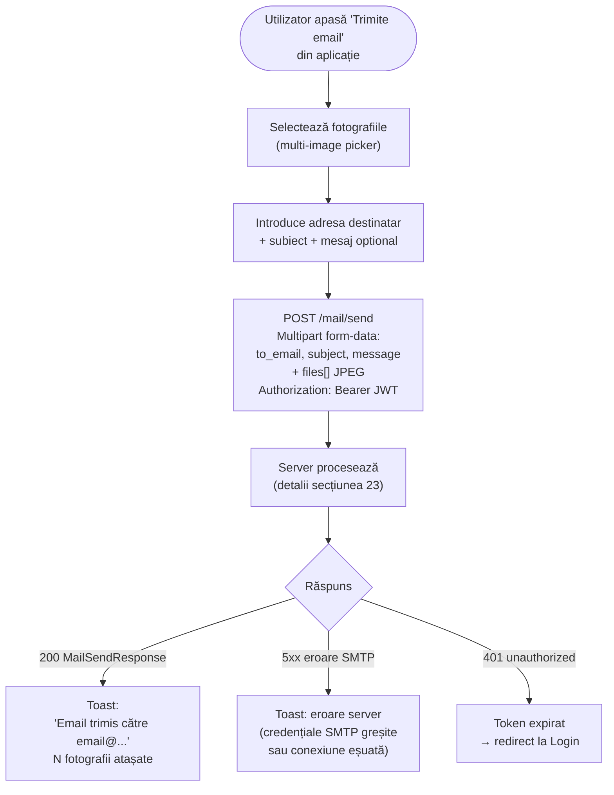

---

## SERVER FASTAPI — ENDPOINT-URI

---

### 12. /auth/register

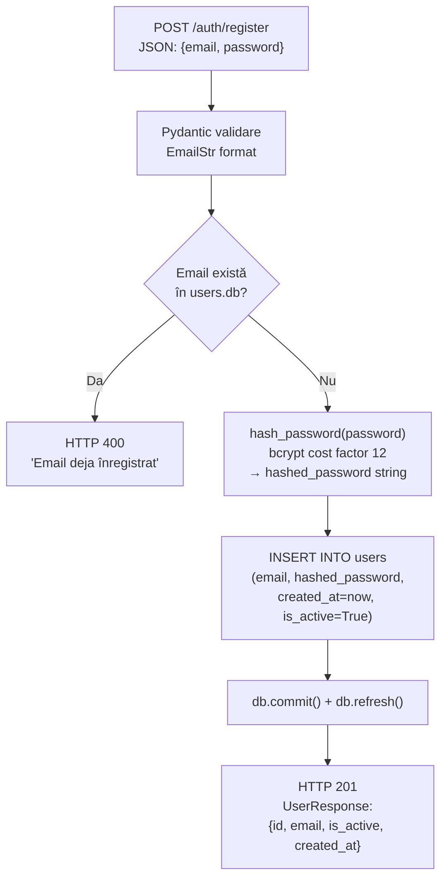

---

### 13. /auth/login

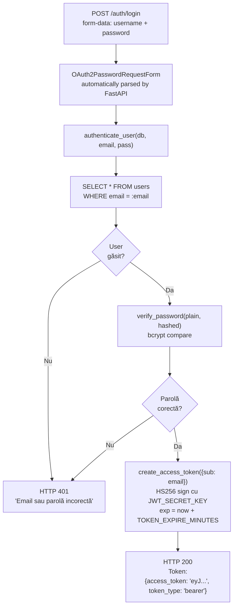

---

### 14. /search_and_correct

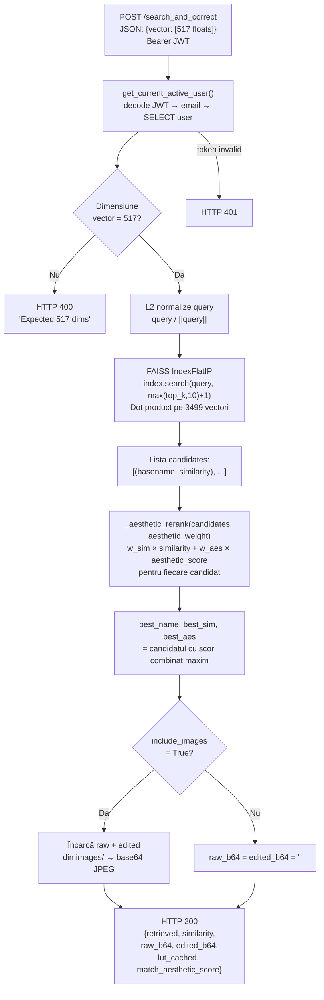

---

### 15. /blur-sensitive — calea Gemini

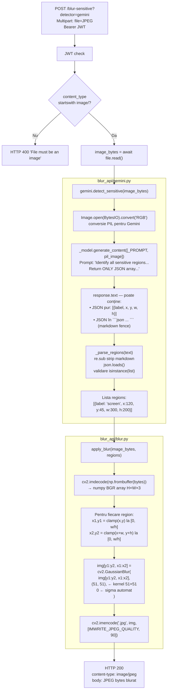

---

### 16. /blur-sensitive — calea locală YOLOv8

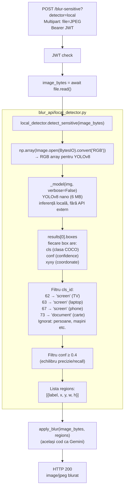

**Diferența față de Gemini:**

| Aspect | Gemini | YOLOv8 local |
|--------|--------|--------------|
| Viteza | ~1000–1500 ms | ~80–100 ms |
| Conexiune externă | Da (Google API) | Nu (totul local) |
| Cost | Per API call | Gratuit |
| Categorii detectate | Orice obiect sensibil semantic | Numai clase COCO mapate |
| Detectează badge-uri/ID | Da | Nu (absent din COCO) |

---

### 17. /mail/send

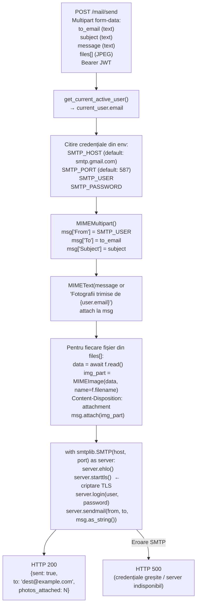

---

### 18. /batch/process

```mermaid
flowchart TD
    IN4["POST /batch/process\nMultipart: files[] (max 100 JPEG)\nBearer JWT"] --> CHECK{len(files) > 100?}
    CHECK -->|Da| E400C["HTTP 400 'Maximum 100 images'"]
    CHECK -->|Nu| LOOP2["Pentru fiecare fișier:"]

    subgraph BATCH_LOOP["Procesare per imagine (server-side inference)"]
        LOOP2 --> READ3["PIL.open → RGB → float32 array"]
        READ3 --> VEC2["get_hybrid_vector(pil_img)\nCLIP ViT-B-32 + MobileNetV3\n→ 517-dim vector"]
        VEC2 --> RET2["retrieve_similar(clip_vec, defect_vec, top_k=10)"]
        RET2 --> RERANK2["_aesthetic_rerank() → best match"]
        RERANK2 --> CORR2["correct_clahe() + apply_lut_moderated()\n→ CLAHE + LUT blend 0.2"]
        CORR2 --> B64["np_to_base64() → JPEG base64"]
    end

    B64 --> RESP2["HTTP 200 BatchResponse:\n{results: [BatchResult...],\nprocessed: N, failed: M}"]
```

---

### 19. /cluster

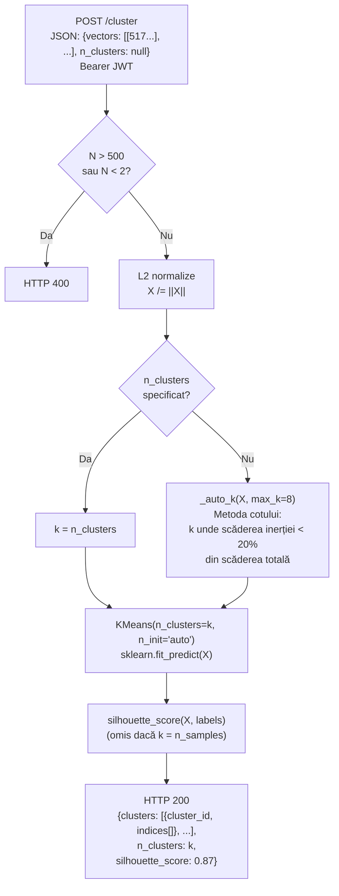

---

### 20. /lut/{basename}

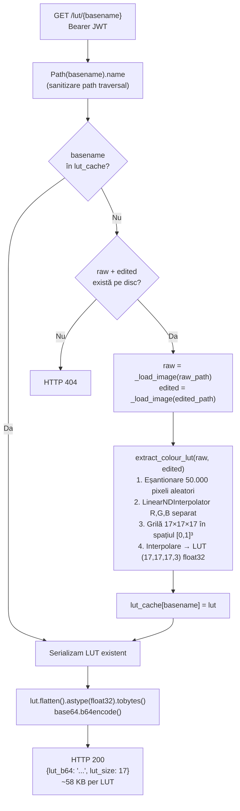

---

### 21. /style/*

```mermaid
flowchart TD
    subgraph SETUP["Configurare stil — POST /style/vectors"]
        S1["JSON: {vectors: [[517...], ...], session_id: null}"] --> S2["Validare dimensiuni"]
        S2 --> S3["session_id = uuid4() dacă null\nstyle_profiles[session_id] = np.array(vectors)"]
        S3 --> S4["HTTP 200: {session_id, vectors_stored}"]
    end

    subgraph SEARCH["Căutare cu stil — POST /style/search"]
        SS1["JSON: {vector, session_id}"] --> SS2["style_vecs = style_profiles[session_id]"]
        SS2 --> SS3["FAISS top-51 rezultate\npentru query vector"]
        SS3 --> SS4["_style_constrained_retrieve:\n1. centroid = mean(style_vecs), normalize\n2. radius = 1 - min(sims_to_centroid)\n3. threshold = 1 - radius × 1.2\n4. filtru: weighted_matrix[i] @ centroid ≥ threshold"]
        SS4 --> SS5["Semantic guard:\nCLIP-only cosine(query[:512], ref[:512]) ≥ 0.55\nAltfel: fallback la global top-1"]
        SS5 --> SS6["HTTP 200:\n{retrieved, similarity,\nstyle_matched, style_fallback, lut_cached}"]
    end
```

---

## EXPLICAȚII DETALIATE

---

### 22. Cum funcționează blur — detaliu complet

#### Flux end-to-end cu Gemini

```mermaid
sequenceDiagram
    actor U as Utilizator
    participant A as Android
    participant S as Server FastAPI
    participant G as Gemini Vision API

    U->>A: Selectează imagine cu ecran/document vizibil
    A->>A: Citește bytes JPEG din Uri
    A->>S: POST /blur-sensitive?detector=gemini\nAuthorization: Bearer JWT\nContent-Type: multipart/form-data\n[JPEG bytes]

    S->>S: JWT decode → utilizator valid
    S->>S: image_bytes = await file.read()
    S->>S: PIL.Image.open(BytesIO(image_bytes)).convert("RGB")

    S->>G: generate_content([PROMPT, pil_image])\nPrompt trimis: "Identify all sensitive regions...\nReturn ONLY a JSON array with absolute pixel coordinates"

    Note over G: Gemini analizează semantic imaginea:<br/>înțelege context (TV decorativă vs ecran cu date,<br/>carte vs document cu date sensibile)

    G-->>S: response.text = '[{"label":"screen","x":120,"y":45,"w":300,"h":200}]'\n(sau învelit în ```json ... ```)

    S->>S: _parse_regions(text):\n1. re.sub strip markdown fences\n2. json.loads()\n3. isinstance(list) check

    S->>S: apply_blur(image_bytes, regions):\npentru fiecare {x,y,w,h}:\n  x1,y1 = max(0, x), max(0, y)\n  x2,y2 = min(W, x+w), min(H, y+h)\n  img[y1:y2, x1:x2] = GaussianBlur(kernel=51×51)

    Note over S: Kernel 51×51 = blur puternic,<br/>conținutul devine nerecognoscibil

    S->>S: cv2.imencode(".jpg", img, quality=90)
    S-->>A: HTTP 200 Content-Type: image/jpeg\n[JPEG bytes — imaginea blurată]

    A->>A: Bitmap.decodeByteArray(body.bytes())
    A->>U: Afișează imaginea blurată side-by-side cu originalul
```

#### Flux end-to-end cu YOLOv8 local

```mermaid
sequenceDiagram
    actor U as Utilizator
    participant A as Android
    participant S as Server FastAPI

    U->>A: Selectează imagine
    A->>S: POST /blur-sensitive?detector=local\n[JPEG bytes]

    S->>S: np.array(Image.open(BytesIO).convert("RGB"))

    Note over S: YOLOv8 nano rulează LOCAL pe server<br/>Fără apel extern, fără cost, offline

    S->>S: _model(img, verbose=False)\nYOLOv8 nano detectează toate obiectele din COCO

    S->>S: Filtru clase COCO sensibile:\n62 (TV) → "screen"\n63 (laptop) → "screen"\n67 (cell phone) → "screen"\n73 (carte/book) → "document"\nALTE clase: ignorate

    S->>S: Filtru confidence ≥ 0.40\n(sub prag = obiect nesigur, ignorat)

    S->>S: apply_blur() — același cod ca Gemini

    S-->>A: HTTP 200 JPEG blurat
    A->>U: Afișează rezultat
```

#### De ce kernel 51×51?

```
Kernel mic (5×5):  blur slab, text poate fi citit
Kernel mediu (21×21): blur mediu, text greu de citit
Kernel 51×51:     blur puternic — conținut complet nerecognoscibil ✓
Kernel 101×101:   overkill, procesare mai lentă fără beneficiu real
```

Sigma = 0 înseamnă că OpenCV calculează sigma automat din dimensiunea kernel-ului: `σ = 0.3 × ((51-1)/2 - 1) + 0.8 ≈ 7.7`

---

### 23. Cum funcționează mail — detaliu complet

```mermaid
sequenceDiagram
    actor U as Utilizator
    participant A as Android
    participant S as Server FastAPI
    participant SMTP as SMTP Server (Gmail)

    U->>A: Selectează fotografii din galerie
    U->>A: Introduce: to_email, subject, mesaj

    A->>A: Pentru fiecare fotografie:\n  bytes = ContentResolver.openInputStream(uri)\n  RequestBody.create(bytes, MediaType("image/jpeg"))\n  MultipartBody.Part.createFormData("files", filename, body)

    A->>S: POST /mail/send\nAuthorization: Bearer JWT\nContent-Type: multipart/form-data\n\nto_email=destinatar@example.com\nsubject=Fotografiile tale\nmessage=Salut...\nfiles[0]=<JPEG bytes>\nfiles[1]=<JPEG bytes>

    S->>S: JWT decode → current_user.email

    Note over S: Credențiale SMTP din variabile de mediu:<br/>SMTP_HOST, SMTP_PORT, SMTP_USER, SMTP_PASSWORD<br/>NU sunt în cod, NU sunt în request

    S->>S: msg = MIMEMultipart()\nmsg["From"] = SMTP_USER\nmsg["To"] = to_email\nmsg["Subject"] = subject

    S->>S: msg.attach(MIMEText(\n  message or\n  f"Fotografii trimise de {current_user.email}"\n))

    loop Pentru fiecare fișier din request
        S->>S: data = await f.read()\nimg_part = MIMEImage(data, name=filename)\nimg_part.add_header("Content-Disposition",\n  "attachment", filename=filename)\nmsg.attach(img_part)
    end

    S->>SMTP: smtplib.SMTP(host, port=587)
    S->>SMTP: server.ehlo()
    S->>SMTP: server.starttls() ← negociază TLS
    S->>SMTP: server.login(SMTP_USER, SMTP_PASSWORD)
    S->>SMTP: server.sendmail(SMTP_USER, to_email, msg.as_string())

    SMTP-->>U: Email livrat cu fotografiile atașate

    S-->>A: HTTP 200\n{"sent": true, "to": "dest@...", "photos_attached": 2}
    A->>U: Toast: "Email trimis — 2 fotografii atașate"
```

#### Structura email-ului generat

```
From: SMTP_USER (configurat în env)
To: adresa introdusă de utilizator
Subject: subiectul introdus de utilizator

Body (text/plain):
  Fotografii trimise de utilizator@email.com
  [sau mesajul personalizat al utilizatorului]

Attachment 1: photo_1.jpg (image/jpeg)
Attachment 2: photo_2.jpg (image/jpeg)
...
```

#### De ce STARTTLS și nu SSL direct?

```
Port 465 / SSL direct  → conexiune criptată de la bun început
Port 587 / STARTTLS    → conexiune plain → upgrade la TLS mid-session

Am ales STARTTLS (587) pentru că:
• Este standardul modern recomandat de RFC 8314
• Gmail, Outlook, și aproape toți providerii îl suportă
• smtplib.SMTP + starttls() este mai simplu de implementat cross-provider
  decât smtplib.SMTP_SSL care necesită context SSL explicit
```

---

*Diagrame generate conform stării codului din ramura `refactorizare` la data ultimului commit.*
