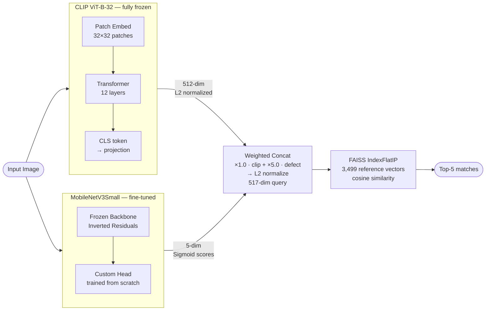
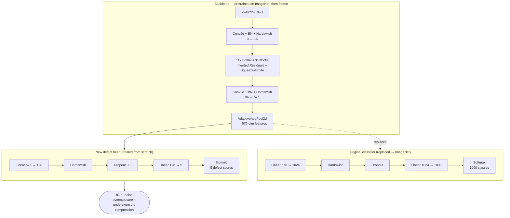
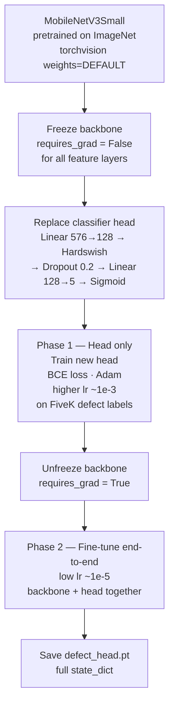
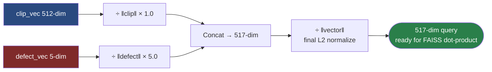

# PhotoMatch V2

An intelligent photo correction app that finds visually similar expert-edited reference photos and applies automatic color and exposure corrections to match them.

## How It Works

```
User Photo
  ↓
[CLIP ViT-B-32]        → 512-dim semantic embedding
[MobileNetV3Small]     → 5-dim defect scores (blur, noise, over/under-exposure, compression)
[Weighted Concat]      → 517-dim hybrid query vector
[FAISS Search]         → Top-5 matches from 3,499 reference pairs
[CLAHE]                → Exposure correction (LAB color space)
[3D LUT]               → Color grading from RAW→expert-edited mapping
[LUT Blend]            → Final output (blend strength = 0.2)
```

## Model Architecture

### 1. Hybrid Retrieval — Two Models Combined



---

### 2. MobileNetV3Small — Modification & Frozen Layers

The original ImageNet classifier head was removed and replaced with a 5-output defect head. The backbone was frozen during early training and only the new head was updated.



---

### 3. Transfer Learning — Training Procedure



---

### 4. Hybrid Vector — Weighting & Normalization



---

## Performance

| Method | Top-1 Accuracy | Top-5 Mean |
|--------|---------------|-----------|
| CLIP-only | 85.0% | 82.2% |
| **Hybrid (CLIP + Defect)** | **98.8%** | **98.6%** |

Hybrid outperforms CLIP-only on 100% of test queries (N=200).

## Project Structure

```
mvpBachelor/
├── server/
│   ├── server.py              # FastAPI server — hybrid retrieval, CLAHE, LUT
│   ├── server_v2.py           # Alternative server version
│   ├── requirements.txt
│   ├── defect_head.pt         # MobileNetV3Small checkpoint (4.1 MB)
│   ├── hybrid_vectors.npz     # Pre-computed 517-dim vectors for 3,499 images (7.8 MB)
│   ├── images/
│   │   ├── raw/               # FiveK RAW JPEG reference images
│   │   └── edited/            # Expert-edited JPEG reference images
│   ├── evaluate.py
│   └── start_server.bat       # Windows shortcut to launch server
└── android/
    └── src/main/java/com/photomatch/
        ├── MainActivity.java
        ├── ProcessingActivity.java
        ├── ResultsActivity.java
        ├── BatchActivity.java
        ├── ClusterActivity.java
        ├── BurstActivity.java
        ├── FaceGroupsActivity.java
        ├── PipelineActivity.java
        └── api/               # Retrofit client & data models
```

## Tech Stack

**Backend**
- Python 3.10+, FastAPI, Uvicorn
- PyTorch 2.3, TorchVision 0.18, OpenCLIP 2.24
- FAISS-CPU 1.8, OpenCV 4.9, Pillow 10.3, NumPy, SciPy

**Android**
- Java, min SDK 26 (Android 8.0), target SDK 34
- Retrofit 2.9, Glide 4.16, Room 2.6
- TensorFlow Lite 2.13, MLKit Face Detection
- Material Design 3, AndroidX Jetpack

## Setup

### Server

```bash
cd server
pip install -r requirements.txt
uvicorn server:app --host 0.0.0.0 --port 8000
```

Or on Windows, double-click `start_server.bat`.

Swagger UI is available at `http://localhost:8000/docs`.

**Required files** (already included in repo):
- `server/defect_head.pt`
- `server/hybrid_vectors.npz`
- `server/images/raw/` and `server/images/edited/`

### Android App

1. Open the `android/` folder in Android Studio.
2. Set your PC's local IP in `ApiClient.java`:
   ```java
   // Default: "192.168.1.132" — change to your machine's IP
   ```
   Or configure it at runtime via the in-app server IP dialog.
3. Make sure your phone and PC are on the same Wi-Fi network.
4. Build and run on a device with Android 8.0+.
5. Grant permissions: Camera, Storage, Internet.

## API Endpoints

| Method | Path | Description |
|--------|------|-------------|
| `GET` | `/health` | Server status, vector count, device |
| `POST` | `/search_and_correct` | Vector search + reference image retrieval |
| `POST` | `/style/search` | Style-constrained retrieval |
| `POST` | `/style/vectors` | Store style profile vectors |
| `GET` | `/lut/{basename}` | Download 3D LUT for a reference image |
| `POST` | `/cluster` | K-means clustering on vectors |
| `GET` | `/image/raw/{basename}` | Serve raw reference image |
| `GET` | `/image/edited/{basename}` | Serve edited reference image |

## Key Configuration

**Server (`server.py`)**
```python
CLIP_WEIGHT   = 1.0   # weight of CLIP embedding in hybrid vector
DEFECT_WEIGHT = 5.0   # weight of defect scores
LUT_STRENGTH  = 0.2   # color correction blend strength (0.0–1.0)
LUT_SIZE      = 17    # 3D LUT grid resolution (17³)
```

**Android (`ApiClient.java`)**
```java
DEFAULT_IP = "192.168.1.132"   // override via in-app settings
// Read timeout: 600s (for batch processing)
```

## Features

- Single image correction (camera or gallery)
- Batch processing of multiple images
- Burst photo clustering and best-shot selection
- Face detection and clustering
- Style-constrained search and filtering
- Favorites management with local Room database
- Response caching to avoid redundant server calls
- Pipeline visualization (step-by-step processing)
- Histogram view and aesthetic scoring
- Real-time blur detection (Laplacian-based)

## Dataset

3,499 image pairs from the [MIT-Adobe FiveK dataset](https://data.csail.mit.edu/graphics/fivek/) — RAW source images paired with expert-edited versions used as correction targets.
