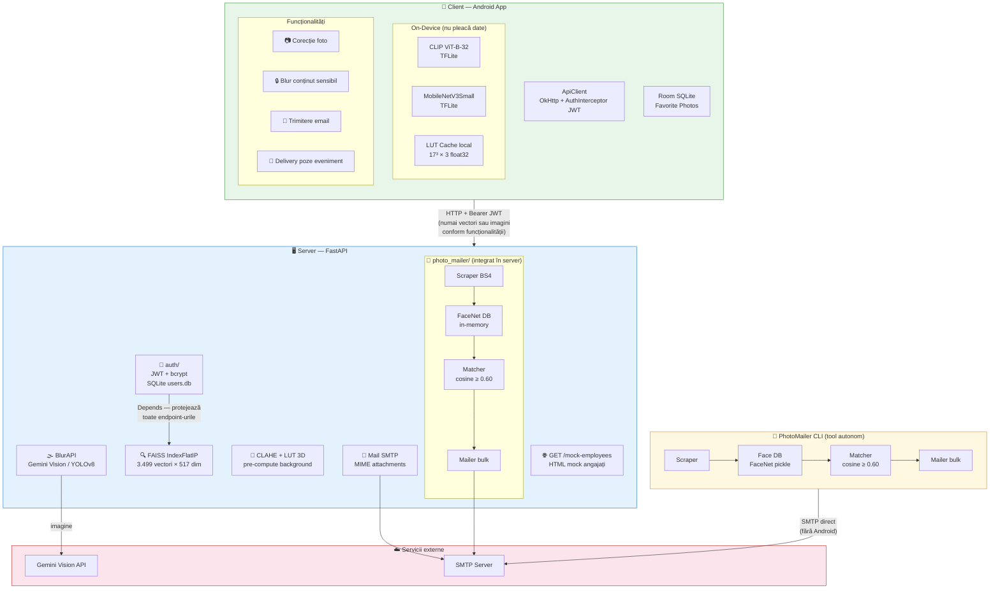
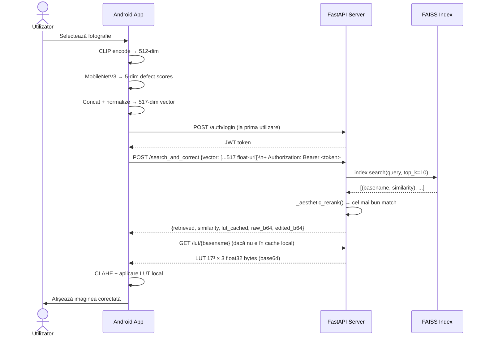
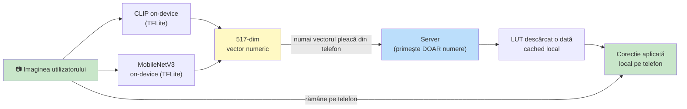
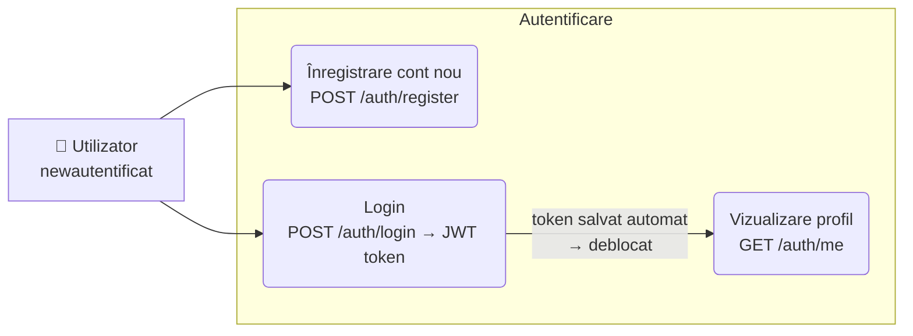
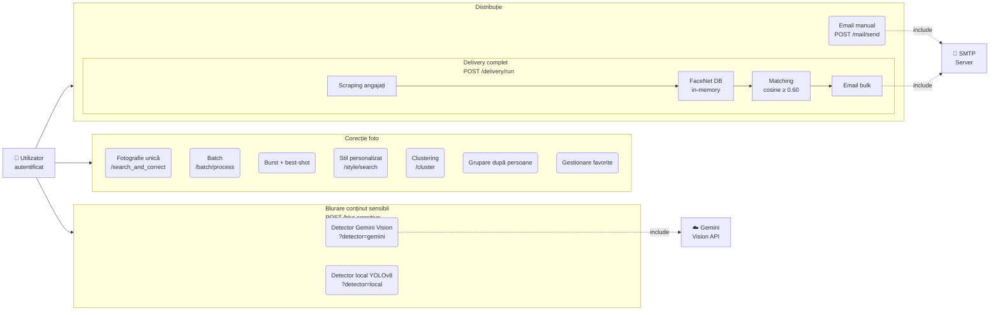
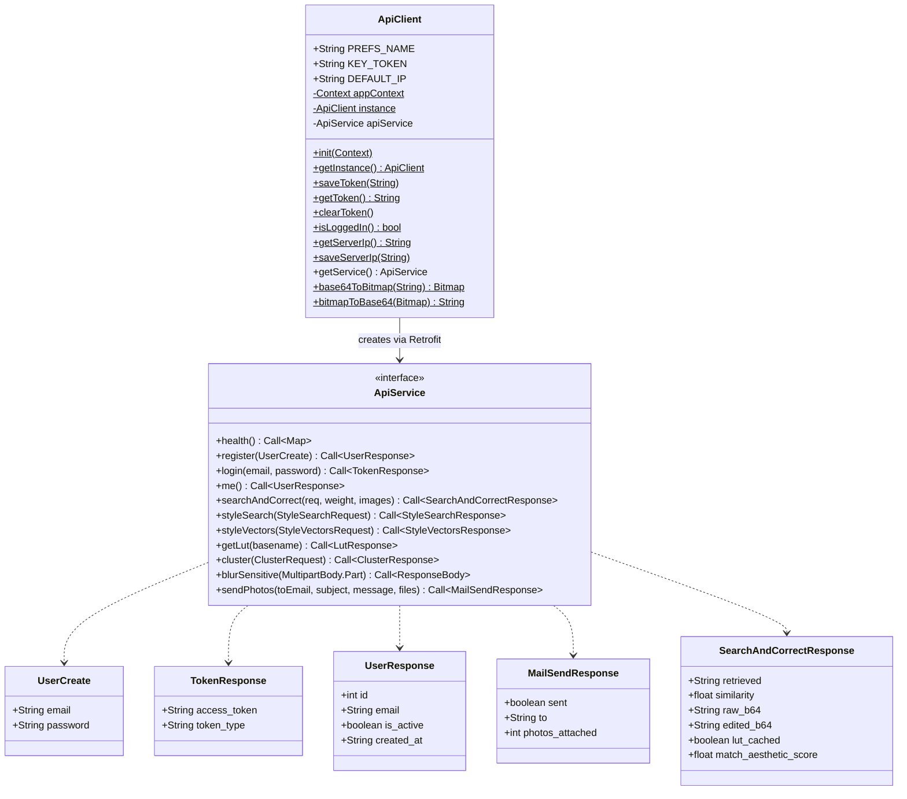
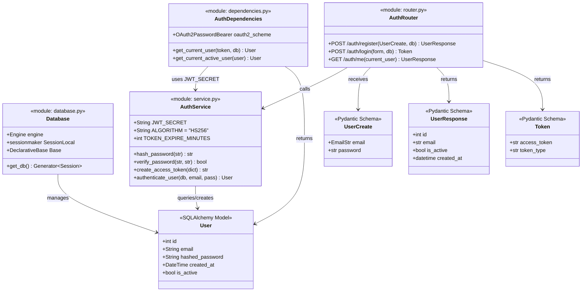
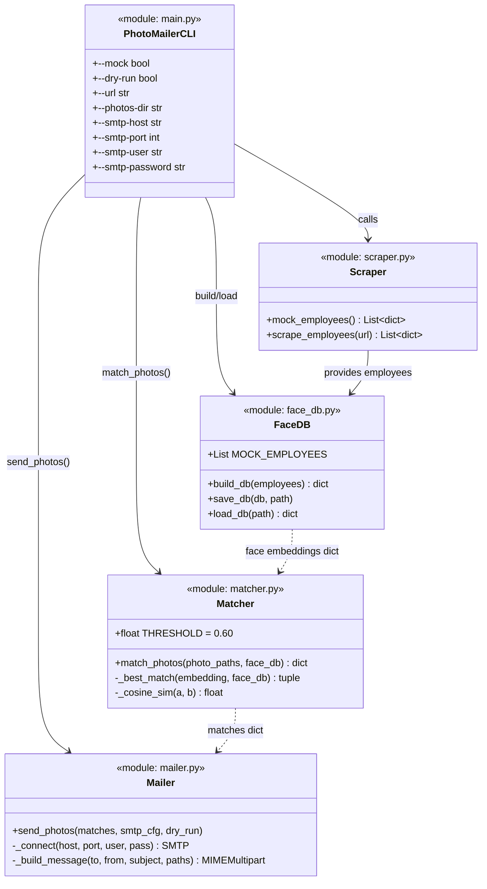
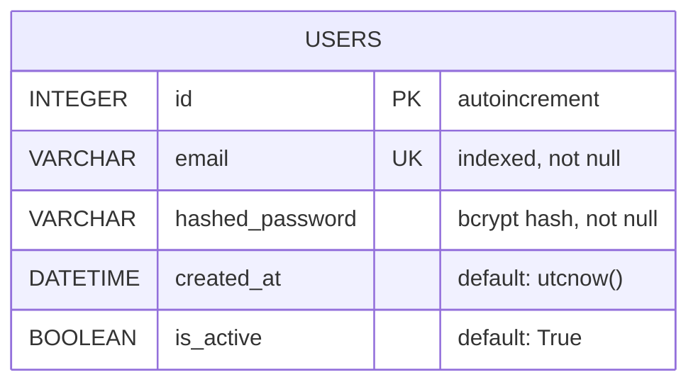
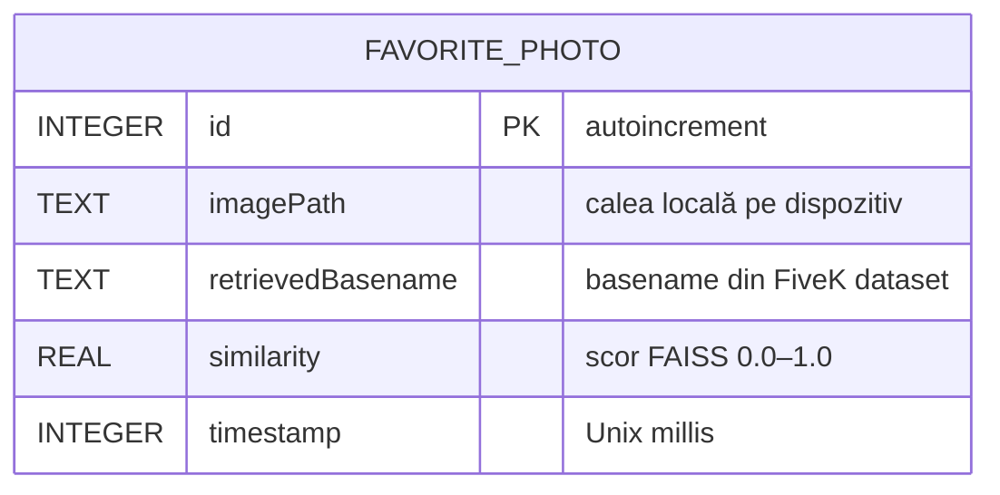

# PhotoMatch V2 — Ramura `refactorizare`

> Această ramură extinde versiunea de bază cu autentificare JWT, integrarea BlurAPI, trimitere email din Android și securizarea tuturor endpoint-urilor. Conținutul de mai jos reprezintă **Capitolul 3 — Proiectarea arhitecturii soluției** documentat conform stării actuale a proiectului.

---

## Cuprins

1. [Ce aduce ramura `refactorizare`](#1-ce-aduce-ramura-refactorizare)
2. [Stack tehnologic](#2-stack-tehnologic)
3. [Capitolul 3 — Proiectarea arhitecturii soluției](#3-capitolul-3--proiectarea-arhitecturii-soluției)
   - [3.1 Arhitectura generală a soluției](#31-arhitectura-generală-a-soluției)
   - [3.2 Diagrama de cazuri de utilizare](#32-diagrama-de-cazuri-de-utilizare)
   - [3.3 Diagrama de clase](#33-diagrama-de-clase)
   - [3.4 Structura bazei de date](#34-structura-bazei-de-date)
4. [Instalare și rulare](#4-instalare-și-rulare)
5. [API Reference](#5-api-reference)
6. [Structura proiectului](#6-structura-proiectului)

---

## 1. Ce aduce ramura `refactorizare`

| Componentă | Adăugat față de `main` |
|---|---|
| `server/auth/` | Modul JWT complet: register / login / me, bcrypt, SQLite users.db |
| `server/blur_api/` | BlurAPI integrat în server: Gemini Vision + YOLOv8 local + `?detector=` |
| `server/photo_mailer/` | Modul delivery integrat în server: scraper BS4 + FaceNet DB + matcher + mailer |
| `server_v2.py` | Toate endpoint-urile protejate cu JWT; `/mail/send`; `/delivery/run` pipeline complet; `GET /mock-employees` |
| `android/api/` | `ApiClient` cu `AuthInterceptor`; `ApiService` cu login/register/mail/delivery; 6 modele noi |
| `photomatch-lite/` | Proiect Android demonstrativ cu pattern `BaseApiActivity<TReq,TRes>` — 3 activități, fiecare sub 50 linii |
| `FLOWS.md` | Diagrame detaliate pentru toate activitățile Android și toate endpoint-urile server |
| Refactorizare server | Helper-e `_load_image()`, `_correct_image()`, `DEFECT_NAMES` — −18 linii cod duplicat |

---

## 2. Stack tehnologic

**Server (Python 3.11)**

| Bibliotecă | Rol |
|---|---|
| FastAPI + Uvicorn | Framework HTTP și server ASGI |
| PyTorch 2.3 + TorchVision | CLIP ViT-B-32 + MobileNetV3Small defect head |
| OpenCLIP 2.24 | Encodare imagini CLIP |
| FAISS-CPU 1.8 | Index de similaritate vectorială |
| OpenCV 4.9 + Pillow | Procesare imagini, CLAHE, blur |
| SciPy + scikit-learn | Interpolare LUT 3D, K-Means clustering |
| google-generativeai | Gemini Vision API (BlurAPI) |
| ultralytics | YOLOv8 nano (detector local BlurAPI) |
| deepface | FaceNet 512-dim embeddings (delivery pipeline) |
| beautifulsoup4 | Scraping pagini HTML angajați |
| python-jose + passlib | JWT HS256 + bcrypt hashing |
| SQLAlchemy | ORM SQLite pentru users.db |
| smtplib | Trimitere email SMTP cu atașamente |

**Android (Java, min SDK 26)**

| Bibliotecă | Rol |
|---|---|
| Retrofit 2.9 + OkHttp | Client HTTP, `AuthInterceptor` JWT |
| TensorFlow Lite 2.13 | CLIP + defect head on-device |
| Google MLKit | Detecție facială on-device |
| Room 2.6 | Baza de date locală favorite |
| Glide 4.16 | Încărcare și cache imagini |
| Material Design 3 | UI components |

---

## 3. Capitolul 3 — Proiectarea arhitecturii soluției

Soluția urmează un model **client-server** clasic, la care se adaugă un instrument de automatizare standalone:

| Rol | Tehnologie | Cuprinde |
|---|---|---|
| **Client** | Android app (Java) | Corecție foto, blurare conținut sensibil, trimitere email, delivery |
| **Server** | FastAPI (Python) | JWT auth, FAISS, LUT, BlurAPI, mail endpoint, delivery/run |
| **Tool autonom** | PhotoMailer CLI (Python) | Scraping angajați, FaceNet matching, distribuție bulk email fără UI |

> **De ce nu sunt 3 proiecte separate?** BlurAPI și funcționalitatea de email sunt module integrate în server, apelate direct de clientul Android. PhotoMailer CLI rezolvă același scenariu de distribuție email dar pentru administratori, automatizat, fără interacțiune — reutilizând codul de matching și mail deja existent pe server.

---

### 3.1 Arhitectura generală a soluției

#### Diagrama de ansamblu — model client-server


```mermaid
flowchart TD
    subgraph CLIENT["📱 Client — Android App"]
        direction TB
        subgraph ONDEV["On-Device (nu pleacă date)"]
            CLIP_DEV["CLIP ViT-B-32\nTFLite"]
            MNV3_DEV["MobileNetV3Small\nTFLite"]
            LUT_CACHE["LUT Cache local\n17³ × 3 float32"]
        end
        subgraph FEATURES["Funcționalități"]
            F1["📷 Corecție foto"]
            F2["🔒 Blur conținut sensibil"]
            F3["📧 Trimitere email"]
            F4["🚀 Delivery poze eveniment"]
        end
        AC["ApiClient\nOkHttp + AuthInterceptor JWT"]
        DB_LOCAL["Room SQLite\nFavorite Photos"]
    end

    subgraph SERVER["🖥️ Server — FastAPI"]
        direction TB
        AUTH_S["🔑 auth/\nJWT + bcrypt\nSQLite users.db"]
        FAISS_S["🔍 FAISS IndexFlatIP\n3.499 vectori × 517 dim"]
        LUT_S["🎨 CLAHE + LUT 3D\npre-compute background"]
        BLUR_S["🌫️ BlurAPI\nGemini Vision / YOLOv8"]
        MAIL_S["📨 Mail SMTP\nMIME attachments"]
        subgraph DEL_S["👥 photo_mailer/ (integrat în server)"]
            direction LR
            SC2["Scraper BS4"] --> FDB2["FaceNet DB\nin-memory"]
            FDB2 --> MT2["Matcher\ncosine ≥ 0.60"]
            MT2 --> ML2["Mailer bulk"]
        end
        MOCK_S["🌐 GET /mock-employees\nHTML mock angajați"]
    end

    subgraph EXTERNAL["☁️ Servicii externe"]
        GEM["Gemini Vision API"]
        SMTP["SMTP Server"]
    end

    subgraph STANDALONE["🐍 PhotoMailer CLI (tool autonom)"]
        direction LR
        SC["Scraper"] --> FDB["Face DB\nFaceNet pickle"]
        FDB --> MT["Matcher\ncosine ≥ 0.60"]
        MT --> ML["Mailer bulk"]
    end

    CLIENT -->|"HTTP + Bearer JWT\n(numai vectori sau imagini\nconform funcționalității)"| SERVER
    AUTH_S -->|"Depends — protejează\ntoate endpoint-urile"| FAISS_S
    BLUR_S -->|"imagine"| GEM
    MAIL_S --> SMTP
    ML2 --> SMTP
    STANDALONE -->|"SMTP direct\n(fără Android)"| SMTP

    style CLIENT fill:#e8f5e9,stroke:#388e3c
    style SERVER fill:#e3f2fd,stroke:#1976d2
    style STANDALONE fill:#fff8e1,stroke:#f57f17
    style EXTERNAL fill:#fce4ec,stroke:#c62828
```

#### Fluxul principal PhotoMatch (sequence diagram)


```mermaid
sequenceDiagram
    actor U as Utilizator
    participant A as Android App
    participant S as FastAPI Server
    participant F as FAISS Index

    U->>A: Selectează fotografie
    A->>A: CLIP encode → 512-dim
    A->>A: MobileNetV3 → 5-dim defect scores
    A->>A: Concat + normalize → 517-dim vector
    A->>S: POST /auth/login (la prima utilizare)
    S-->>A: JWT token
    A->>S: POST /search_and_correct {vector: [...517 float-uri]}\n+ Authorization: Bearer <token>
    S->>F: index.search(query, top_k=10)
    F-->>S: [(basename, similarity), ...]
    S->>S: _aesthetic_rerank() → cel mai bun match
    S-->>A: {retrieved, similarity, lut_cached, raw_b64, edited_b64}
    A->>S: GET /lut/{basename} (dacă nu e în cache local)
    S-->>A: LUT 17³ × 3 float32 bytes (base64)
    A->>A: CLAHE + aplicare LUT local
    A->>U: Afișează imaginea corectată
```

#### Principiul privacy-first


```mermaid
flowchart LR
    IMG["📷 Imaginea utilizatorului"]
    CLIP_ONDEV["CLIP on-device\n(TFLite)"]
    MNV3_ONDEV["MobileNetV3\non-device (TFLite)"]
    VEC["517-dim\nvector numeric"]
    SERVER["Server\n(primește DOAR numere)"]
    LUT_DL["LUT descărcat o dată\ncached local"]
    CORRECT["Corecție aplicată\nlocal pe telefon"]

    IMG --> CLIP_ONDEV
    IMG --> MNV3_ONDEV
    CLIP_ONDEV --> VEC
    MNV3_ONDEV --> VEC
    VEC -->|"numai vectorul pleacă din telefon"| SERVER
    SERVER --> LUT_DL
    LUT_DL --> CORRECT
    IMG -->|"rămâne pe telefon"| CORRECT

    style IMG fill:#c8e6c9
    style VEC fill:#fff9c4
    style SERVER fill:#bbdefb
    style CORRECT fill:#c8e6c9
```

> **Excepție:** endpoint-urile `/blur-sensitive` și `/mail/send` trimit imaginea la server — utilizatorul este informat explicit.

---

### 3.2 Diagrama de cazuri de utilizare

#### Diagrama 1 — Autentificare


```mermaid
flowchart LR
    ACT["👤 Utilizator\nnewautentificat"]

    subgraph AUTH["Autentificare"]
        UC1("Înregistrare cont nou\nPOST /auth/register")
        UC2("Login\nPOST /auth/login → JWT token")
        UC3("Vizualizare profil\nGET /auth/me")
    end

    ACT --> UC1
    ACT --> UC2
    UC2 -->|"token salvat automat\n→ deblocat"| UC3
```

#### Diagrama 2 — Client Android autentificat


```mermaid
flowchart LR
    ACT["👤 Utilizator\nautentificat"]
    ACT_GEM["☁️ Gemini\nVision API"]
    ACT_SMTP["📧 SMTP\nServer"]

    subgraph CORRECT["Corecție foto"]
        UC1("Fotografie unică\n/search_and_correct")
        UC2("Batch\n/batch/process")
        UC3("Burst + best-shot")
        UC4("Stil personalizat\n/style/search")
        UC5("Clustering\n/cluster")
        UC6("Grupare după persoane")
        UC7("Gestionare favorite")
    end

    subgraph BLUR["Blurare conținut sensibil\nPOST /blur-sensitive"]
        UC8("Detector Gemini Vision\n?detector=gemini")
        UC9("Detector local YOLOv8\n?detector=local")
    end

    subgraph DIST["Distribuție"]
        UC10("Email manual\nPOST /mail/send")
        subgraph DEL["Delivery complet\nPOST /delivery/run"]
            D1["Scraping angajați"] --> D2["FaceNet DB\nin-memory"]
            D2 --> D3["Matching\ncosine ≥ 0.60"]
            D3 --> D4["Email bulk"]
        end
    end

    ACT --> CORRECT
    ACT --> BLUR
    ACT --> DIST

    UC8 -.->|include| ACT_GEM
    UC10 -.->|include| ACT_SMTP
    D4 -.->|include| ACT_SMTP
```

---

### 3.3 Diagrama de clase

#### Diagrama 1 — Clientul Android (stratul API)


```mermaid
classDiagram
    class ApiClient {
        +String PREFS_NAME
        +String KEY_TOKEN
        +String DEFAULT_IP
        -Context appContext$
        -ApiClient instance$
        -ApiService apiService
        +init(Context)$
        +getInstance() ApiClient$
        +saveToken(String)$
        +getToken() String$
        +clearToken()$
        +isLoggedIn() bool$
        +getServerIp() String$
        +saveServerIp(String)$
        +getService() ApiService
        +base64ToBitmap(String) Bitmap$
        +bitmapToBase64(Bitmap) String$
    }

    class ApiService {
        <<interface>>
        +health() Call~Map~
        +register(UserCreate) Call~UserResponse~
        +login(email, password) Call~TokenResponse~
        +me() Call~UserResponse~
        +searchAndCorrect(req, weight, images) Call~SearchAndCorrectResponse~
        +styleSearch(StyleSearchRequest) Call~StyleSearchResponse~
        +styleVectors(StyleVectorsRequest) Call~StyleVectorsResponse~
        +getLut(basename) Call~LutResponse~
        +cluster(ClusterRequest) Call~ClusterResponse~
        +blurSensitive(MultipartBody.Part) Call~ResponseBody~
        +sendPhotos(toEmail, subject, message, files) Call~MailSendResponse~
    }

    class UserCreate {
        +String email
        +String password
    }

    class TokenResponse {
        +String access_token
        +String token_type
    }

    class UserResponse {
        +int id
        +String email
        +boolean is_active
        +String created_at
    }

    class MailSendResponse {
        +boolean sent
        +String to
        +int photos_attached
    }

    class SearchAndCorrectResponse {
        +String retrieved
        +float similarity
        +String raw_b64
        +String edited_b64
        +boolean lut_cached
        +float match_aesthetic_score
    }

    ApiClient --> ApiService : creates via Retrofit
    ApiService ..> UserCreate
    ApiService ..> TokenResponse
    ApiService ..> UserResponse
    ApiService ..> MailSendResponse
    ApiService ..> SearchAndCorrectResponse
```

#### Diagrama 2 — Modulul de autentificare server (`auth/`)


```mermaid
classDiagram
    class User {
        <<SQLAlchemy Model>>
        +int id
        +String email
        +String hashed_password
        +DateTime created_at
        +bool is_active
    }

    class Database {
        <<module: database.py>>
        +Engine engine
        +sessionmaker SessionLocal
        +DeclarativeBase Base
        +get_db() Generator~Session~
    }

    class AuthService {
        <<module: service.py>>
        +String JWT_SECRET
        +String ALGORITHM = "HS256"
        +int TOKEN_EXPIRE_MINUTES
        +hash_password(str) str
        +verify_password(str, str) bool
        +create_access_token(dict) str
        +authenticate_user(db, email, pass) User
    }

    class AuthDependencies {
        <<module: dependencies.py>>
        +OAuth2PasswordBearer oauth2_scheme
        +get_current_user(token, db) User
        +get_current_active_user(user) User
    }

    class AuthRouter {
        <<module: router.py>>
        +POST /auth/register(UserCreate, db) UserResponse
        +POST /auth/login(form, db) Token
        +GET /auth/me(current_user) UserResponse
    }

    class UserCreate {
        <<Pydantic Schema>>
        +EmailStr email
        +str password
    }

    class UserResponse {
        <<Pydantic Schema>>
        +int id
        +str email
        +bool is_active
        +datetime created_at
    }

    class Token {
        <<Pydantic Schema>>
        +str access_token
        +str token_type
    }

    Database --> User : manages
    AuthService --> User : queries/creates
    AuthDependencies --> AuthService : uses JWT_SECRET
    AuthDependencies --> User : returns
    AuthRouter --> AuthService : calls
    AuthRouter --> UserCreate : receives
    AuthRouter --> UserResponse : returns
    AuthRouter --> Token : returns
```

#### Diagrama 3 — PhotoMailer (pipeline CLI Python)


```mermaid
classDiagram
    class FaceDB {
        <<module: face_db.py>>
        +List MOCK_EMPLOYEES
        +build_db(employees) dict
        +save_db(db, path)
        +load_db(path) dict
    }

    class Scraper {
        <<module: scraper.py>>
        +mock_employees() List~dict~
        +scrape_employees(url) List~dict~
    }

    class Matcher {
        <<module: matcher.py>>
        +float THRESHOLD = 0.60
        +match_photos(photo_paths, face_db) dict
        -_best_match(embedding, face_db) tuple
        -_cosine_sim(a, b) float
    }

    class Mailer {
        <<module: mailer.py>>
        +send_photos(matches, smtp_cfg, dry_run)
        -_connect(host, port, user, pass) SMTP
        -_build_message(to, from, subject, paths) MIMEMultipart
    }

    class PhotoMailerCLI {
        <<module: main.py>>
        +--mock bool
        +--dry-run bool
        +--url str
        +--photos-dir str
        +--smtp-host str
        +--smtp-port int
        +--smtp-user str
        +--smtp-password str
    }

    PhotoMailerCLI --> Scraper : calls
    PhotoMailerCLI --> FaceDB : build/load
    PhotoMailerCLI --> Matcher : match_photos()
    PhotoMailerCLI --> Mailer : send_photos()
    Scraper --> FaceDB : provides employees
    FaceDB ..> Matcher : face embeddings dict
    Matcher ..> Mailer : matches dict
```

---

### 3.4 Structura bazei de date

#### Baza de date utilizatori — SQLite (`users.db`, SQLAlchemy)

Creată automat la pornirea serverului (`Base.metadata.create_all(bind=engine)`).


```mermaid
erDiagram
    USERS {
        INTEGER id PK "autoincrement"
        VARCHAR email UK "indexed, not null"
        VARCHAR hashed_password "bcrypt hash, not null"
        DATETIME created_at "default: utcnow()"
        BOOLEAN is_active "default: True"
    }
```

#### Baza de date locală Android — Room/SQLite


```mermaid
erDiagram
    FAVORITE_PHOTO {
        INTEGER id PK "autoincrement"
        TEXT imagePath "calea locală pe dispozitiv"
        TEXT retrievedBasename "basename din FiveK dataset"
        REAL similarity "scor FAISS 0.0–1.0"
        INTEGER timestamp "Unix millis"
    }
```

#### Vectorii de referință PhotoMatch — fișier NPZ (in-memory)

Nu este o bază de date relațională — datele sunt încărcate integral în RAM la startup și indexate în FAISS.

```
hybrid_vectors.npz
├── vectors  — shape (3499, 517)  float32  ~7 MB
└── names    — shape (3499,)      str      basename FiveK (ex. "a1234-Expert-C")

lut_cache    — dict {basename: np.ndarray (17,17,17,3)}  — completat în background
aesthetic_cache — dict {basename: float}                 — completat în background
style_profiles  — dict {session_id: np.ndarray (N,517)}  — per-request, în memorie
```

#### Baza de date faciale PhotoMailer — pickle

```
face_db.pickle
└── dict {
      "user@company.com": np.ndarray (512,)  ← embedding FaceNet
      "user2@company.com": np.ndarray (512,)
      ...
    }
```

> **Limitare de securitate:** fișierul pickle nu este criptat. Soluție recomandată pentru producție: criptare AES a fișierului înainte de stocare.

---

## 4. Instalare și rulare

### Server

```bash
# 1. Instalare dependențe
cd server
pip install -r requirements.txt

# 2. Variabile de mediu obligatorii
set JWT_SECRET_KEY=<un-secret-lung-si-aleatoriu>
set SMTP_USER=adresa@gmail.com
set SMTP_PASSWORD=<app-password-gmail>

# 3. Variabile opționale
set SMTP_HOST=smtp.gmail.com     # default
set SMTP_PORT=587                 # default
set TOKEN_EXPIRE_MINUTES=1440    # default 24h

# 4. Pornire
uvicorn server_v2:app --host 0.0.0.0 --port 8000 --reload
```

Swagger UI: `http://localhost:8000/docs` — butonul **Authorize** permite testarea endpoint-urilor protejate.

### Android

1. Deschide folderul `android/` în Android Studio.
2. IP-ul serverului se configurează la runtime din dialogul din aplicație (default `192.168.1.132`).
3. La prima lansare: **Register** → **Login** → token salvat automat în `SharedPreferences`.
4. Toate cererile ulterioare trimit automat `Authorization: Bearer <token>` prin `AuthInterceptor`.

---

## 5. API Reference

### Autentificare (publice)

| Metodă | Endpoint | Descriere |
|--------|----------|-----------|
| `POST` | `/auth/register` | Înregistrare cont nou `{email, password}` |
| `POST` | `/auth/login` | Login form-encoded → `{access_token, token_type}` |
| `GET` | `/auth/me` | Profil utilizator curent (necesită token) |

### PhotoMatch (necesită JWT)

| Metodă | Endpoint | Descriere |
|--------|----------|-----------|
| `POST` | `/search_and_correct` | FAISS search pe vector 517-dim + referință |
| `POST` | `/apply_lut` | Aplică CLAHE + LUT pe imagine base64 |
| `GET` | `/lut/{basename}` | Descarcă LUT 3D (17³ × 3 float32) |
| `POST` | `/process` | Pipeline complet server-side (CLIP + FAISS + LUT) |
| `POST` | `/batch/process` | Până la 100 imagini într-o singură cerere |
| `POST` | `/cluster` | K-Means pe vectori 517-dim |
| `POST` | `/style/upload` | Înregistrează profil de stil din imagini |
| `POST` | `/style/vectors` | Înregistrează profil de stil din vectori |
| `POST` | `/style/process` | Corecție cu constrângere de stil |
| `POST` | `/style/search` | Retrieval cu constrângere de stil |

### BlurAPI (necesită JWT)

| Metodă | Endpoint | Parametru | Descriere |
|--------|----------|-----------|-----------|
| `POST` | `/blur-sensitive` | `?detector=gemini` | Blurare via Gemini Vision |
| `POST` | `/blur-sensitive` | `?detector=local` | Blurare via YOLOv8 local |

### Email (necesită JWT)

| Metodă | Endpoint | Descriere |
|--------|----------|-----------|
| `POST` | `/mail/send` | Trimite fotografii ca atașamente email (destinatar ales manual) |

### Delivery (necesită JWT)

| Metodă | Endpoint | Descriere |
|--------|----------|-----------|
| `POST` | `/delivery/run` | Pipeline complet: `employees_url` + `photos[]` → scrape → FaceNet DB → match cosine ≥ 0.60 → email bulk → `{matched, emails_sent, failed, details}` |

### Utilitare (publice)

| Metodă | Endpoint | Descriere |
|--------|----------|-----------|
| `GET` | `/health` | Status server, vectori încărcați, device, cache-uri |
| `GET` | `/latency` | Statistici latență (mean/std/min/max per operație) |
| `GET` | `/mock-employees` | Pagină HTML mock cu 3 angajați — folosită ca target pentru delivery demo |
| `GET` | `/image/raw/{basename}` | Servește imaginea RAW din dataset |
| `GET` | `/image/edited/{basename}` | Servește imaginea editată din dataset |

---

## 6. Structura proiectului

```
mvpBachelor/
├── FLOWS.md                      ← diagrame Mermaid pentru toate activitățile + endpoint-urile
├── server/
│   ├── server_v2.py              ← server principal (toate endpoint-urile)
│   ├── requirements.txt
│   ├── auth/
│   │   ├── database.py           ← SQLite engine + get_db()
│   │   ├── models.py             ← User model (SQLAlchemy)
│   │   ├── schemas.py            ← Pydantic: UserCreate, Token, UserResponse
│   │   ├── service.py            ← JWT, bcrypt, authenticate_user()
│   │   ├── dependencies.py       ← get_current_active_user (OAuth2)
│   │   └── router.py             ← /auth/register, /auth/login, /auth/me
│   ├── blur_api/
│   │   ├── gemini.py             ← detect_sensitive() via Gemini Vision
│   │   ├── local_detector.py     ← detect_sensitive() via YOLOv8 nano
│   │   └── blur.py               ← apply_blur() cu OpenCV GaussianBlur
│   ├── photo_mailer/             ← modul delivery integrat în server
│   │   ├── scraper.py            ← scrape_employees() via BeautifulSoup
│   │   ├── face_db.py            ← build_db() — FaceNet embeddings
│   │   ├── matcher.py            ← match_photos() — cosine similarity
│   │   └── mailer.py             ← send_photos() — SMTP bulk
│   ├── defect_head.pt            ← checkpoint MobileNetV3Small (4.1 MB)
│   ├── hybrid_vectors.npz        ← vectori 3499 × 517 (7.8 MB)
│   └── images/
│       ├── raw/                  ← FiveK RAW JPEGs
│       └── edited/               ← Expert-edited JPEGs
├── android/
│   └── src/main/java/com/photomatch/
│       ├── api/
│       │   ├── ApiClient.java    ← OkHttp + AuthInterceptor JWT
│       │   ├── ApiService.java   ← interfață Retrofit (toate endpoint-urile)
│       │   ├── UserCreate.java, TokenResponse.java, UserResponse.java
│       │   ├── MailSendResponse.java
│       │   └── ...               ← modele PhotoMatch existente
│       ├── MainActivity.java
│       ├── ProcessingActivity.java
│       ├── BatchActivity.java
│       ├── ClusterActivity.java
│       ├── BurstActivity.java
│       ├── FaceGroupsActivity.java
│       └── PipelineActivity.java
├── photomatch-lite/              ← proiect Android demonstrativ (BaseApiActivity pattern)
│   └── app/src/main/java/com/photomatch/lite/
│       ├── base/BaseApiActivity.java     ← pattern Template Method (~50 linii)
│       ├── api/                          ← ApiClient, ApiService, modele POJOs
│       └── ui/                           ← LoginActivity, BlurActivity, DeliveryActivity
└── photo_mailer/                 ← PhotoMailer CLI (tool autonom, fără UI)
    ├── scraper.py
    ├── face_db.py
    ├── matcher.py
    ├── mailer.py
    └── main.py
```

---

> Pentru detalii despre arhitectura modelelor ML (CLIP, MobileNetV3, vectorul hibrid, LUT 3D) vezi secțiunea **Model Architecture** din [`main` branch README](https://github.com/alexandraelenadumitrescu/mvpBachelor/blob/main/README.md).
