# PhotoMatch Lite — Delivery & Cluster

## Cuprins
1. [Arhitectură generală](#arhitectură-generală)
2. [Autentificare](#autentificare)
3. [Pipeline Delivery — 3 faze](#pipeline-delivery--3-faze)
   - [Faza 1 — Procesare locală](#faza-1--procesare-locală-on-device)
   - [Faza 2 — Matching pe server](#faza-2--matching-pe-server)
   - [Faza 3 — Trimitere email-uri](#faza-3--trimitere-email-uri)
4. [Cluster (diagnostic)](#cluster-diagnostic)
5. [Construirea bazei de date de fețe](#construirea-bazei-de-date-de-fețe)
6. [Algoritm de matching](#algoritm-de-matching)
7. [Harta endpoint-urilor](#harta-endpoint-urilor)
8. [Modele de date](#modele-de-date)

---

## Arhitectură generală

```mermaid
graph TB
    subgraph Android["📱 Android App"]
        UI[UI / Activities]
        MLKit[Google MLKit\nFace Detection]
        TFLite[FaceNet TFLite\n128-dim embeddings]
        UI --> MLKit
        UI --> TFLite
    end

    subgraph Server["🖥️ FastAPI Server (192.168.1.130:8000)"]
        Auth[Auth Module\nJWT]
        MatchEmb[/delivery/match-embeddings]
        SendMatched[/delivery/send-matched]
        Cluster[/cluster/faces]
        FaceDB[Face DB Builder\nTFLite + DeepFace detect]
        Matcher[Matcher\ncosine sim ≥ 0.55]
        Auth --> MatchEmb
        Auth --> SendMatched
        Auth --> Cluster
        MatchEmb --> FaceDB
        MatchEmb --> Matcher
    end

    subgraph External["🌐 Servicii externe"]
        NexusPage[nexus.html\nGitHub Pages]
        Gmail[Gmail SMTP\nsmtp.gmail.com:587]
        Inbox[alexandradumitrescu04\n@gmail.com]
    end

    Android -->|"JWT Bearer"| Server
    FaceDB -->|"HTTP scrape"| NexusPage
    SendMatched -->|"STARTTLS"| Gmail
    Gmail --> Inbox
```

---

## Autentificare

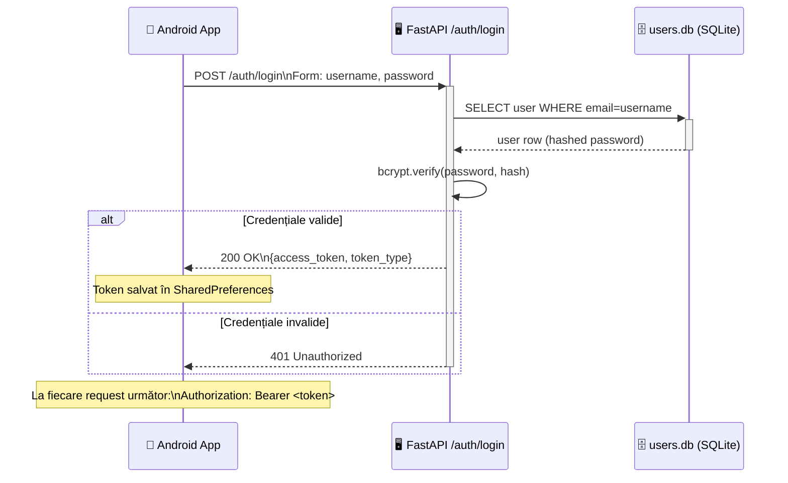

---

## Pipeline Delivery — 3 faze

### Vedere de ansamblu

```mermaid
flowchart LR
    A([📷 Fotografii selectate\ndin galerie / folder]) --> B

    subgraph F1["Faza 1 — ON DEVICE"]
        B[Pentru fiecare poză\none at a time] --> C[MLKit\nFace Detection]
        C --> D[FaceNet TFLite\nEmbed 128-dim]
        D --> E[photo_index +\nembeddings list]
    end

    E --> F

    subgraph F2["Faza 2 — SERVER"]
        F[/delivery/match-embeddings\nJSON ~KB] --> G[Scrape nexus.html]
        G --> H[Build Face DB\n17 angajați]
        H --> I[Cosine similarity\nthreshold 0.55]
        I --> J[matches:\nphoto_index → email]
    end

    J --> K

    subgraph F3["Faza 3 — PER PERSOANĂ"]
        K[Grupare\nemail → photo_indices] --> L[Pentru fiecare email\nîncarcă pozele sale]
        L --> M[/delivery/send-matched\nMultipart ~MB]
        M --> N[Gmail SMTP]
        N --> O[📧 alexandradumitrescu04\n@gmail.com]
    end
```

---

### Faza 1 — Procesare locală (on-device)

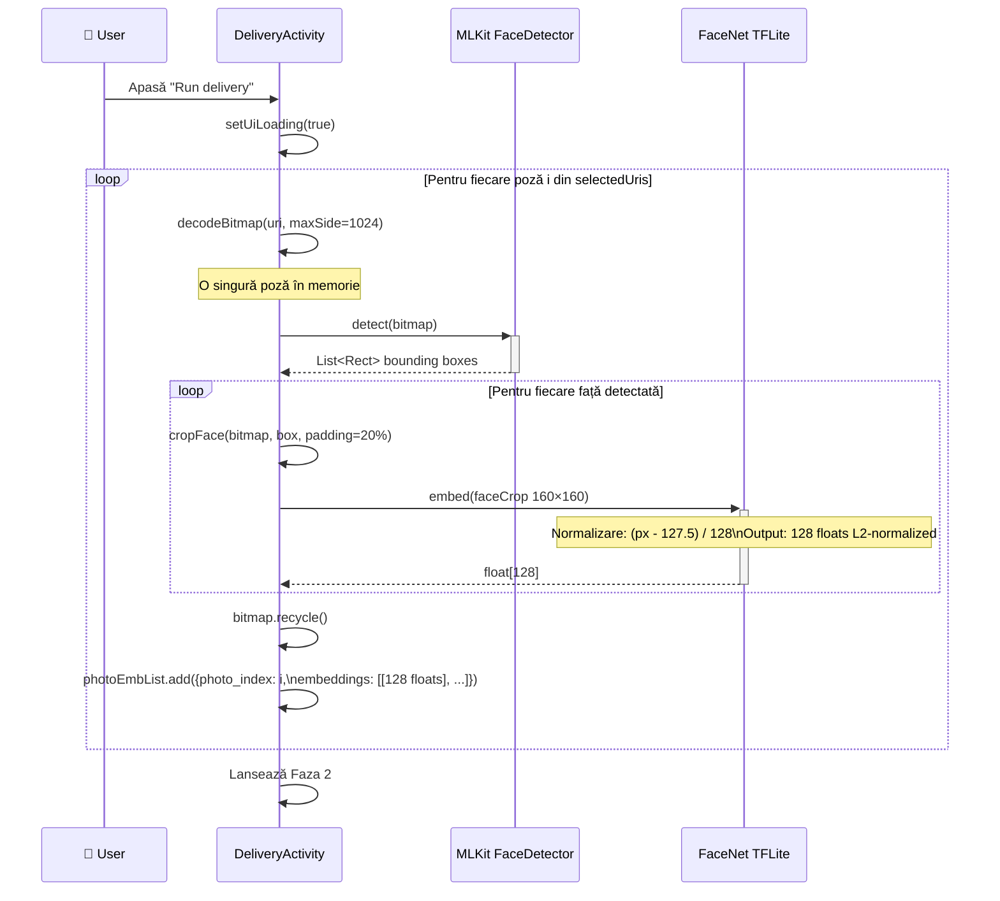

---

### Faza 2 — Matching pe server

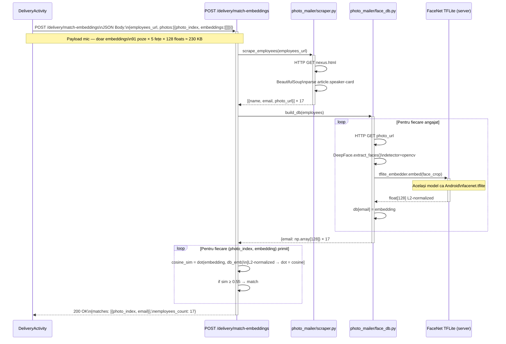

---

### Faza 3 — Trimitere email-uri

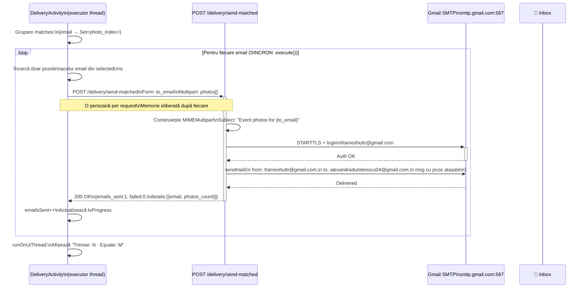

---

## Cluster (diagnostic)

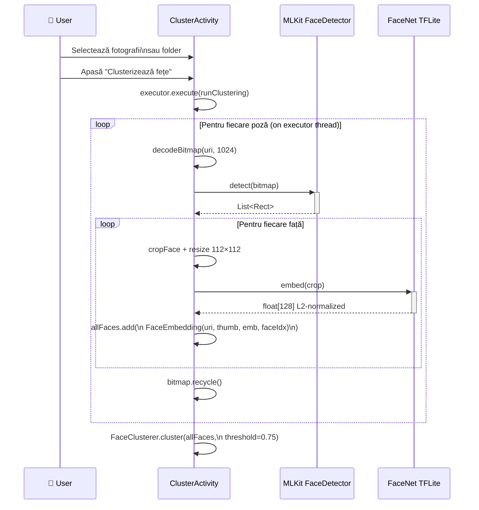

```mermaid
flowchart TD
    A[allFaces list\nN embeddings] --> B

    subgraph Greedy["Greedy Cosine Clustering — O(N²)"]
        B[Pentru fiecare față i\nneasignată] --> C[Crează cluster nou\ncu față i]
        C --> D[Pentru fiecare față j > i\nneasignată]
        D --> E{dot product\ni·j > 0.75?}
        E -->|Da| F[Adaugă j la cluster\nasigned[j] = true]
        E -->|Nu| D
        F --> D
        D --> G{Mai sunt j?}
        G -->|Da| D
        G -->|Nu| H[Salvează cluster\ntreci la i+1]
        H --> B
    end

    B --> I[Sortare descrescător\ndupă mărime]
    I --> J[Asignare personIndex:\n≥2 fețe → 1,2,3...\n1 față → 0 Unmatched]
    J --> K[runOnUiThread: showResults]
```

```mermaid
flowchart LR
    K[clusters list] --> L[tvSummary:\nN fețe · M persoane · K unice]

    subgraph Display["UI — ScrollView"]
        L --> M
        loop Pentru fiecare cluster
            M[Title: Persoana X / Față unică] --> N[HorizontalScrollView\ncu ImageView-uri 100×100]
            N --> M
        end
    end
```

---

## Construirea bazei de date de fețe

```mermaid
flowchart TD
    A([employees_url\nnexus.html]) --> B[scraper.py\nBeautifulSoup parse]
    B --> C{Format detectat}
    C -->|article.speaker-card| D[Extrage:\nname, email,\ndata-email,\nimg.src]
    C -->|.employee-card| E[Extrage:\nname, p email,\nimg.src]
    D --> F
    E --> F

    F[employees list] --> G

    subgraph BuildDB["face_db.py — build_db()"]
        G[Pentru fiecare angajat] --> H[HTTP GET photo_url\ntimeout=10s]
        H --> I{Succes?}
        I -->|Nu| J[skip — log ✗]
        I -->|Da| K[Salvează în fișier temp .jpg]
        K --> L[DeepFace.extract_faces\ndetector=opencv\nenforce_detection=False]
        L --> M[face_arr float64 0-1\n→ PIL Image uint8]
        M --> N[tflite_embedder.embed\nResize 160×160\nNormalizare 127.5/128\nTFLite invoke]
        N --> O[L2-normalize\nfloat32 128-dim]
        O --> P[db[email] = embedding]
        P --> G
    end

    P --> Q[(Face DB\n{email: np.array128})]
```

---

## Algoritm de matching

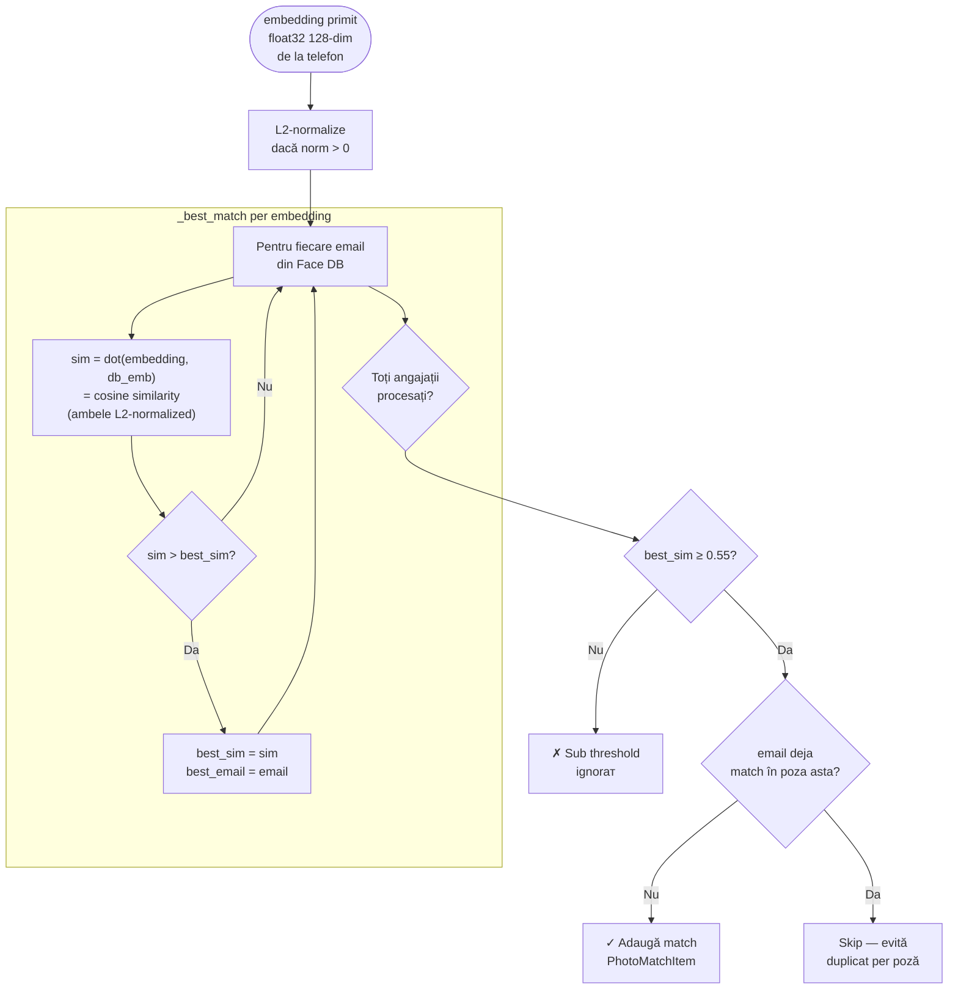

---

## Harta endpoint-urilor

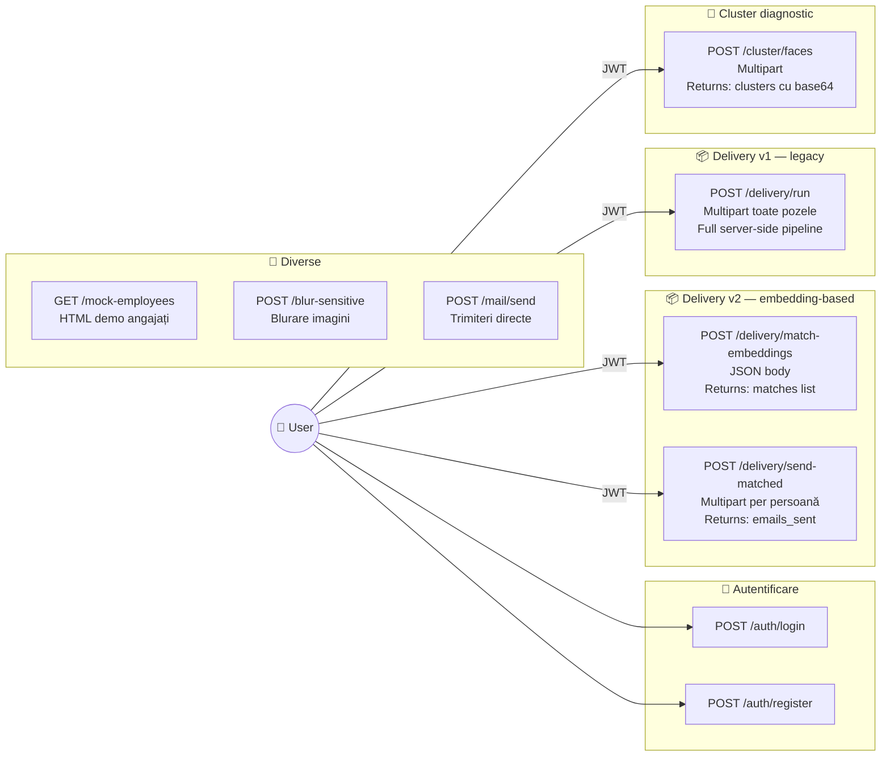

---

## Modele de date

### Request — match-embeddings

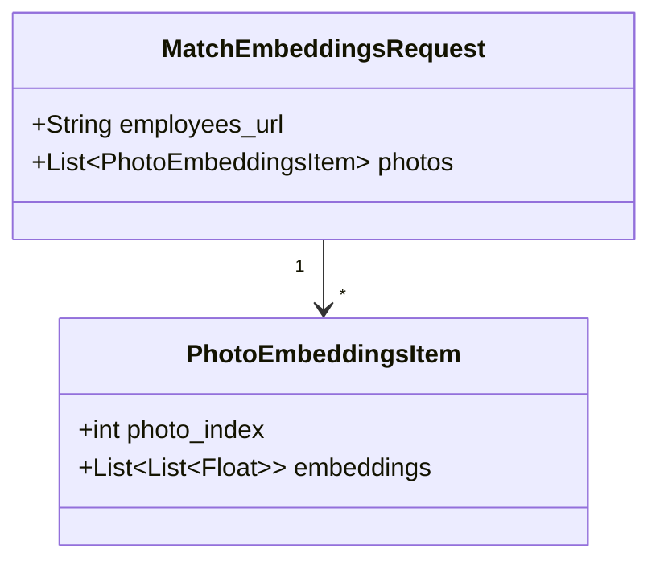

### Response — match-embeddings

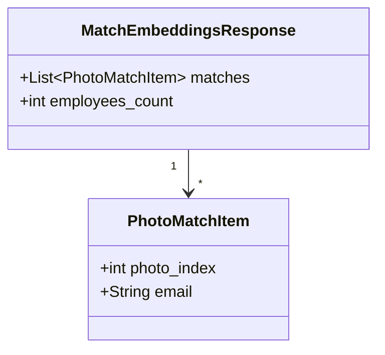

### Face DB (server in-memory)

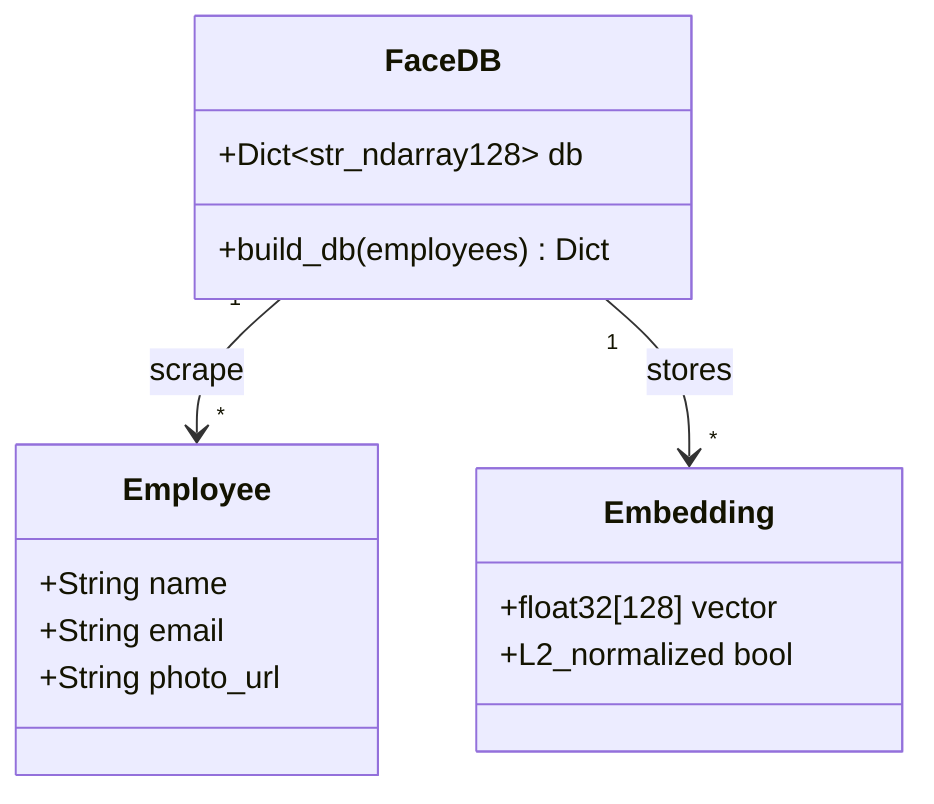

### Cluster (on-device Android)

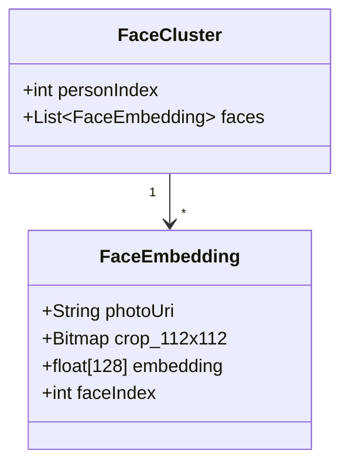

---

## Fluxul complet end-to-end

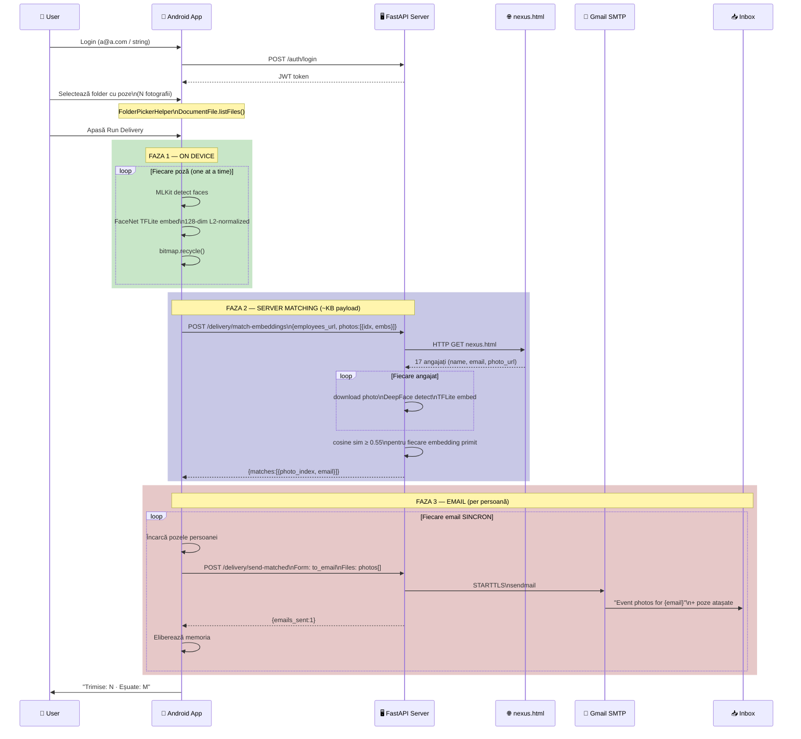
